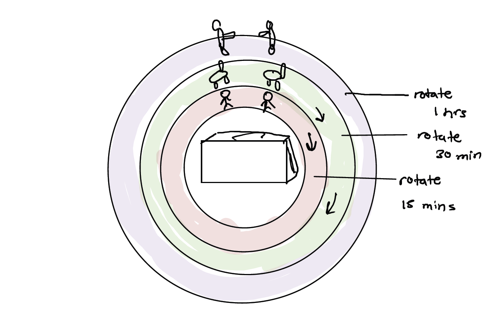
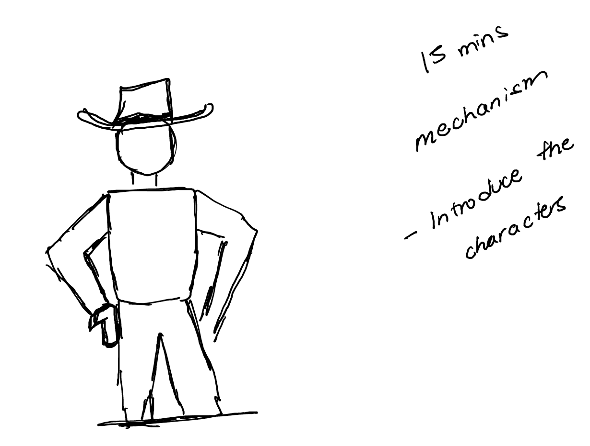
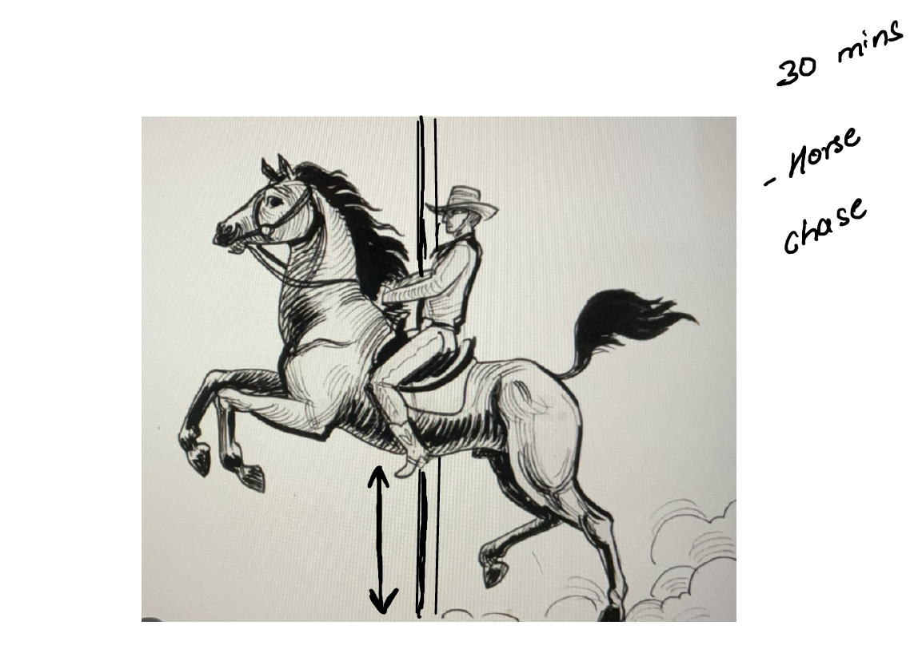
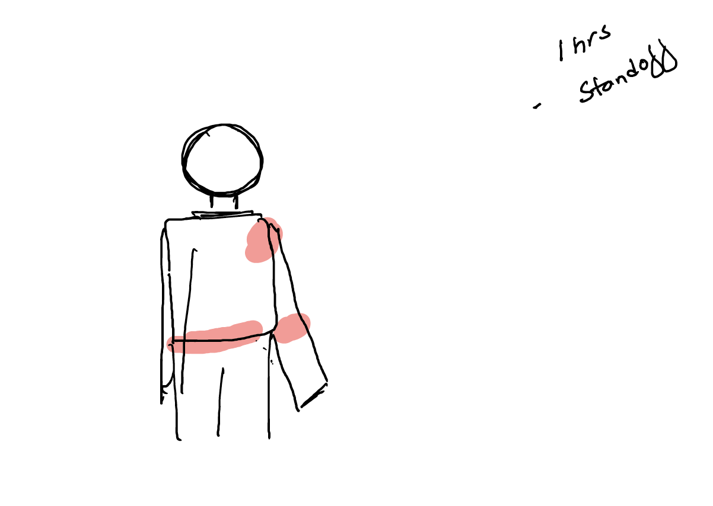
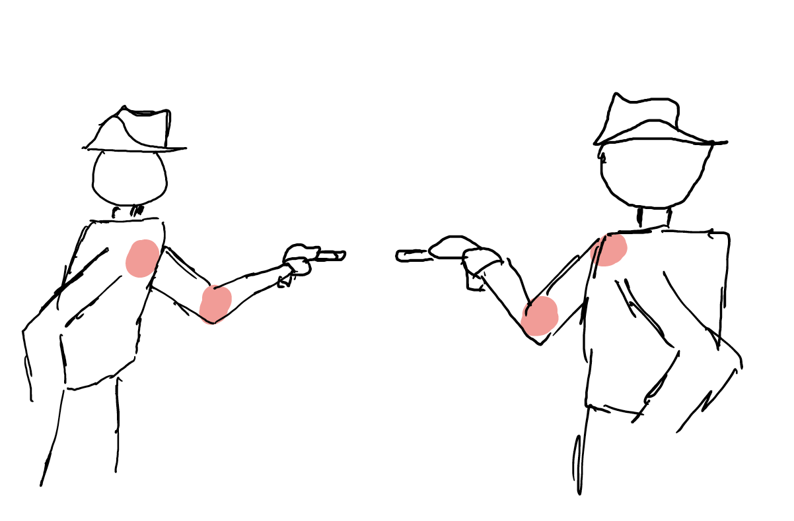
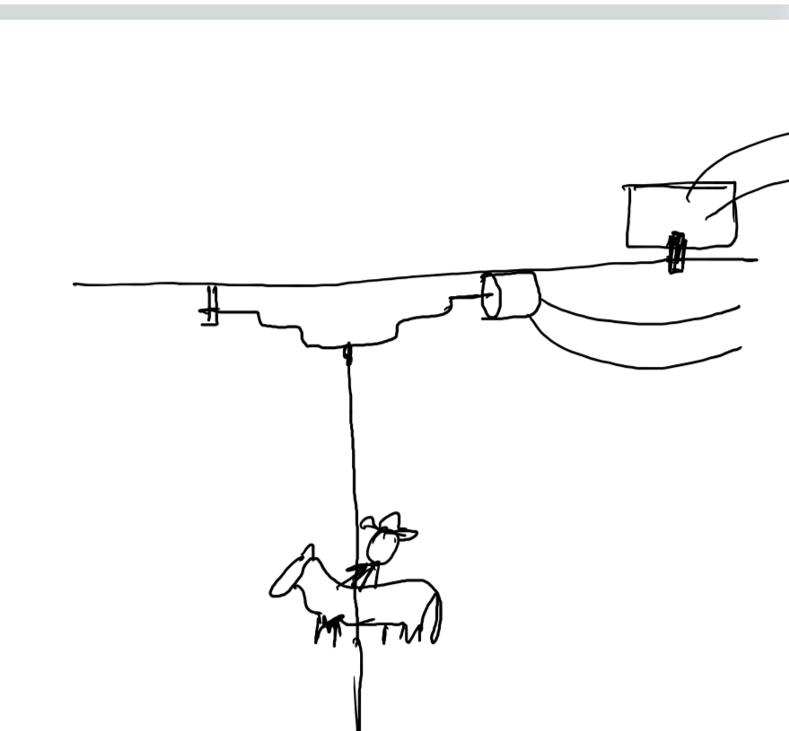

## The Good, and the Bad

### Idea

For my project, I am planning to create a mechanism inspired by the classic Western film, "The Good, the Bad and the Ugly." The goal is to introduce the characters and reenact some of the most iconic scenes from the movie using a mechanism that is powered by a stepper motor.

The mechanism will consist of three circular disks that are connected to the stepper motor. Each disk rotates at a specific time interval - 15 minutes, 30 minutes, and 1 hour, respectively. The disks will be placed on a platform that will rotate to bring the characters in front of the audience. There will be a screen hiding the characters behind it so it has to be brought in front of the audience to reveal the characters.

The screen in front of the audience hides the characters outside of the specific time intervals.

### Inspiration

### 15-Minute Mechanism

During the 15-minute mechanism, the platform where the characters are placed will rotate and bring them in front of the audience. The iconic theme song of the movie will play in the background while the characters are introduced.

### 30-Minute Mechanism

At the 30-minute mark, the characters will be placed back behind the board, and the horse chase platform will rotate ten times, accompanied by the music of a horse chase and the movie's theme song.

The horse also has a mechanism that will make it gallop forward and backward, simulating a horse chase. Similar to theme park ride :https://www.youtube.com/watch?v=in-9ByYtd5w

### 1-Hour Mechanism

Finally, during the 1-hour mechanism, the third and final disk will rotate, and the ultimate showdown will take place. The characters will be brought in front of the audience once again, and one of the characters will fire a bullet, killing the second character.

The red highlighted area are the pivots where the structure fold:

**Initial Position**

**Final Position**

Mechanism for the horse chase:

Overall, the mechanism aims to capture the spirit of the classic movie and provide an engaging and entertaining experience for the audience.
