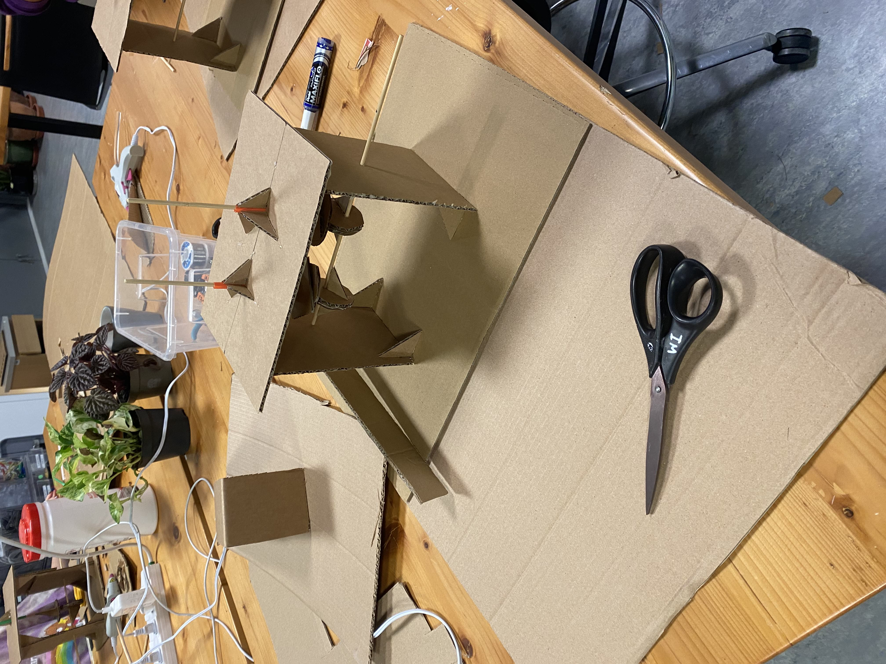
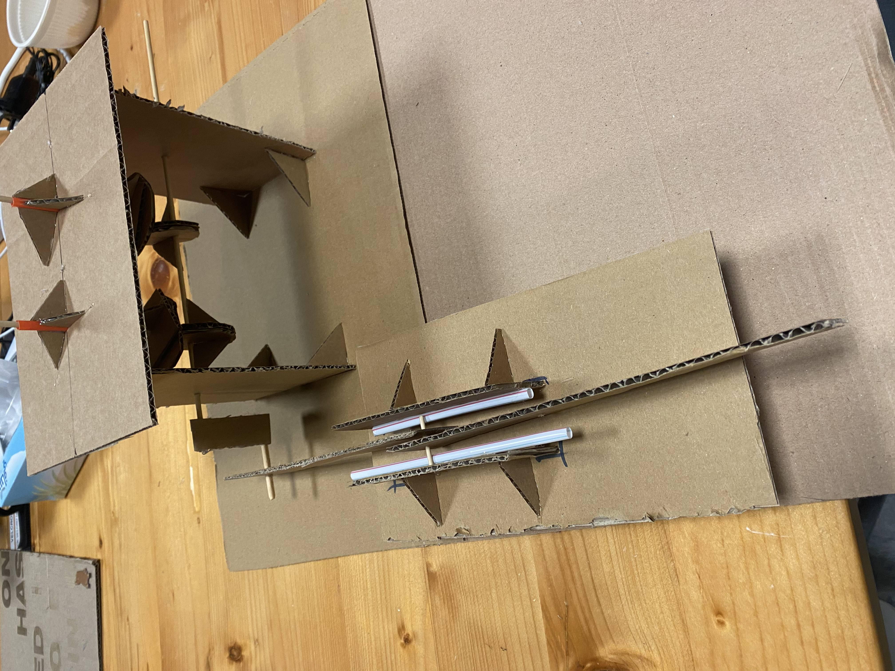
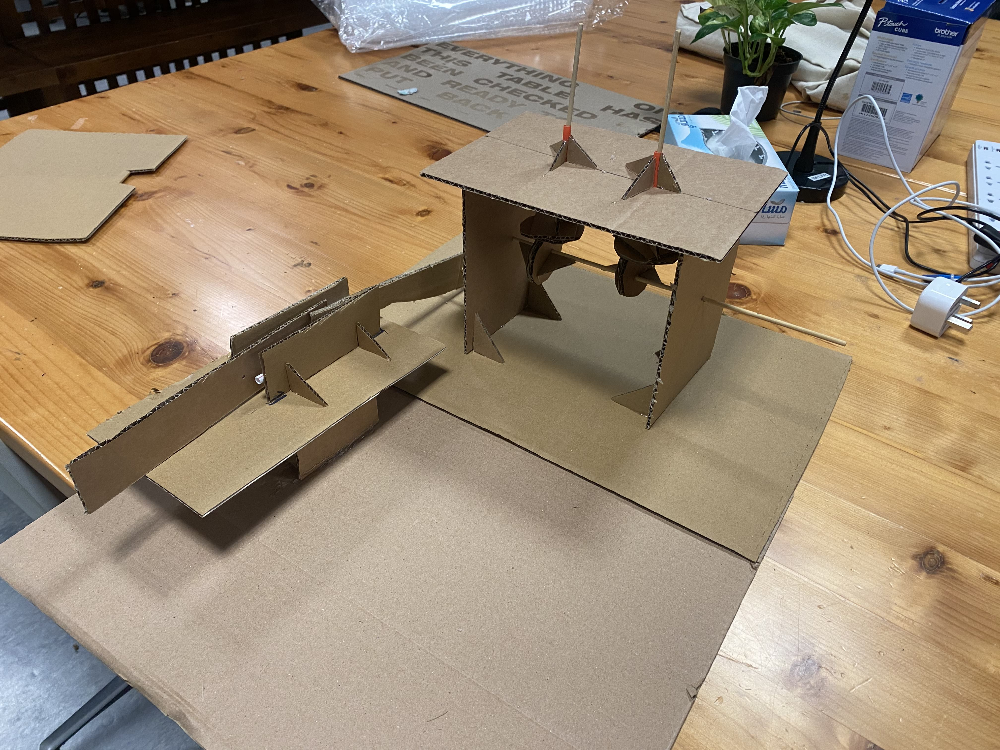
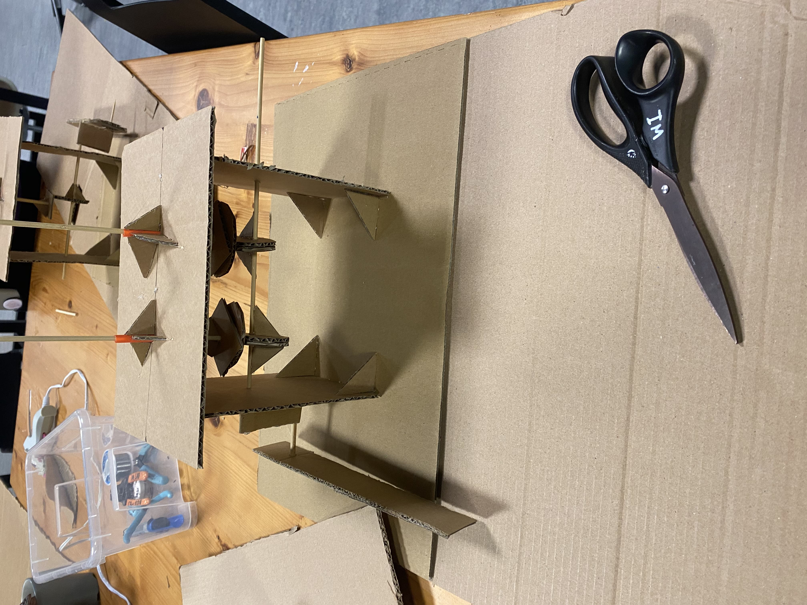

# Cam and Crank Slider

## Overview

This project involves the design, construction and operation of a cam and crank slider mechanism. The objective was to understand the principles of mechanical systems and to apply the concepts learned in class to a practical project. The final machine was powered by a motor and operated for over a minute, demonstrating the success of the project.

## Technical Difficulties

The construction of the mechanism was not without its difficulties. Some of the challenges faced during the project included:

- Unstable slider movement, resulting in wobbling to the left and right
- Inadequate connection between the wheel and central skewer
- Difficulty in determining the appropriate position and height of the slider base

However, these challenges were overcome by thinking back to the discussions during class and working with other students and the application of trial and error methods. Using the straws to restrict wobbling was great fix for the left and right wobbling of the slider, and the connection between the wheel and skewer was improved by adding height to the support system supporting the motor. The issue with the position of the base was figured out using trial and error. 

## Results

The final product was a functioning cam and crank slider mechanism that was able to operate for over a minute, as seen in the videos captured during testing. While the initial run encountered some issues with the connecting rod not being securely attached to the crank system, these were quickly resolved and the mechanism was able to perform successfully.

## Conclusion

This project was a great opportunity to learn about mechanical systems and the physics behind them. The experience was challenging but also rewarding, as the final machine was able to run for over a minute. If I were to improve on my machine and make it better, I would probably create a more elegant and efficient design. Overall, it was a great learning experience and a fun project to work on.

## Videos 

- [Working mechanism of the slider](https://drive.google.com/file/d/1dY9OM5m6-I3AsxRH31PAX3wvs1G33uvT/view?usp=sharing)
- [First Failed attempt](https://drive.google.com/file/d/1vdOJCgcc18Ix3-0J33YdovSXAASFTK_V/view?usp=sharing)
- [Watch 1-minute final result](https://drive.google.com/file/d/1b-bnB2QBqW7ehTLG50vFZGkpTp3i7VJc/view?usp=sharing)  

## WIP images

**Figuring our length of connecting rod**
 

**Slider Design**

 

**Made a cut in the connecting rod to prevent it from striking the base of slider**

 

