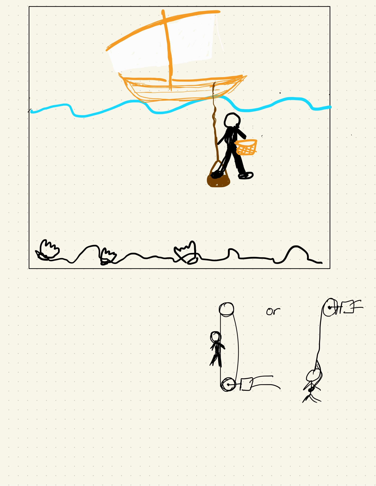
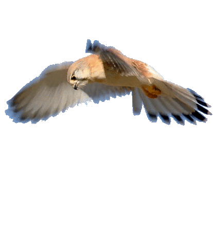
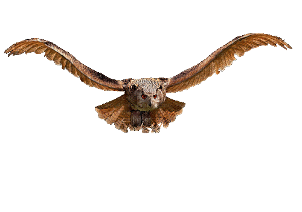
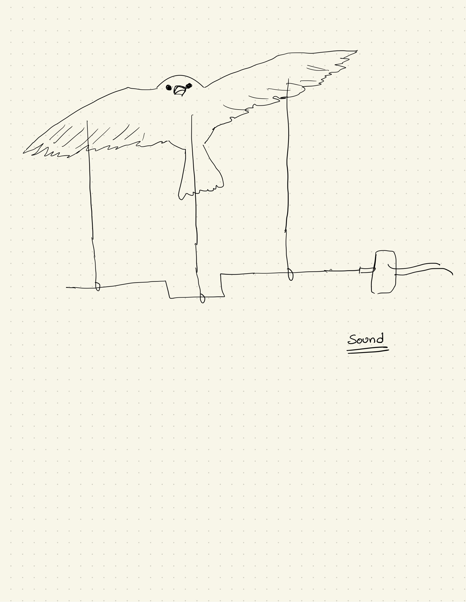
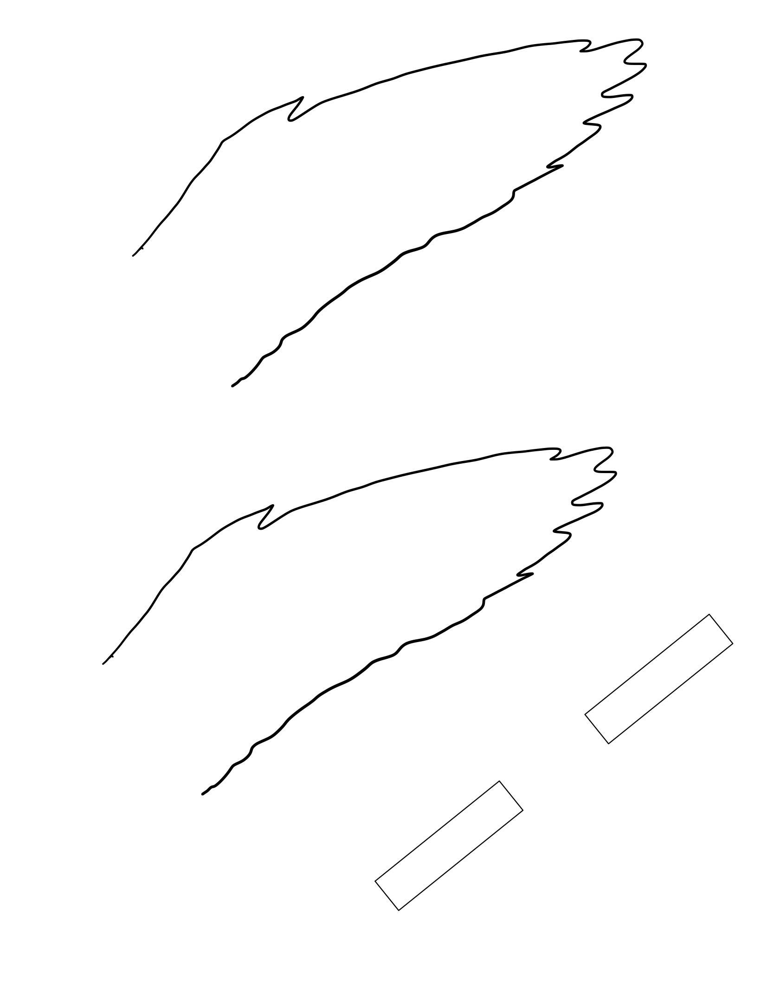
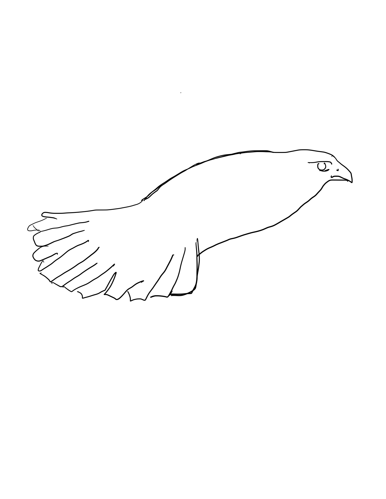

# Ideation

## 1. Pearl Diving Automata

### Introduction

This project is an automata inspired by the pearl diving industry in the United Arab Emirates (UAE).
Pearl diving has been a vital part of the UAE's history and culture, and this project aims to pay homage
to this industry by creating an interactive automata that mimics the movement of a traditional pearl diver in the sea.

### Inspiration

The UAE has a rich history of pearl diving, which was once a major source of income for the local population.
Traditional pearl divers would dive deep into the sea with minimal equipment, using only a nose clip to prevent
water from entering their nostrils and a stone attached to a rope to descend to the seabed. This dangerous and
labor-intensive job required a great deal of skill and courage, and the pearl diving industry has since declined
due to the discovery of oil in the region. However, it remains an important part of the UAE's cultural heritage.

### Concept

The Pearl Diving Automata is a mechanical device that uses a belt actuator to move the diver up and down in the sea,
simulating the traditional diving method used by pearl divers in the UAE. The automata also includes an electromagnet
on the diver's belt that attracts magnetic oysters, simulating the discovery of a pearl. The magnet only works once
every hour, so the diver will only find an oyster occasionally.

The automata is designed to be a tribute to the pearl diving industry and its rich cultural heritage. It showcases
the traditional methods and techniques used by pearl divers and celebrates their bravery and hard work. The automata
is also an educational tool that can be used to teach people about the history and culture of the UAE.

### Conclusion

The Pearl Diving Automata is a unique and creative project that pays homage to the traditional pearl
diving industry in the UAE. The automata will immerse users in the experience of traditional pearl diving,
with the added excitement of discovering a pearl.

### Reference

[Treasures and tradition - find out how pearl diving in Dubai still uses traditional methods](https://www.euronews.com/travel/2021/04/02/treasures-and-tradition-find-out-how-pearl-diving-in-dubai-still-uses-traditional-methods)

## 2. Falconry

### Itroduction

This project is an automata inspired by the ancient art of falconry. Falconry is the practice of hunting with
trained birds of prey, and it has been a part of human culture for thousands of years. This project aims to
pay homage to the tradition of falconry by creating an interactive automata that simulates the movements of a falcon.

### Inspiration

Falconry is a practice that has been used for hunting and sport throughout history. It requires skill, patience,
and a deep understanding of birds of prey. The bond between a falconer and their bird is one of mutual respect
and trust, and the tradition of falconry has been passed down through generations.

### Concept

The Falconry Automata is a mechanical device that uses a mechanism similar to the carousel horse rides in theme
parks to make the falcon flap its wings every 30 minutes. The automata is designed to mimic the movement of a
real falcon.

**Parts**

 

### Reference

[Flying Bird Automata](https://www.google.com/url?sa=i&url=https%3A%2F%2Fwww.youtube.com%2Fwatch%3Fv%3DlcsKRLxfFDM&psig=AOvVaw3yOPj1-RuMhdXctNSUZn9k&ust=1678359157095000&source=images&cd=vfe&ved=0CA4QjhxqFwoTCODnkJ2VzP0CFQAAAAAdAAAAABAD)

[Wooden Bird](https://youtu.be/SLt0sRVcoic)
